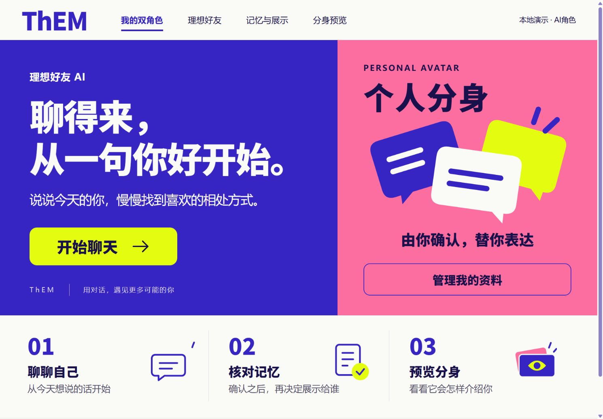

# ThEM · 双角色 AI 社交产品实践

**让分身表达自己，也让自己决定它能说什么。**

**当前版本：v0.1.0 · 本地MVP演示版 · 2026.09.23**。这是发布包版本标识，尚未创建GitHub Release或部署线上服务。

ThEM探索在认识他人之前，通过AI分身了解具体信息的社交方式。这个仓库交付一段可运行的基础流程：聊天与自述 → 记忆候选 → 本人确认 → 单独授权 → 分身预览 → 修改或撤回。



这是本地单人物演示，默认使用固定模拟回复，不需要API账号。截图来自实际页面。匹配、双方分身预聊、真人联系和多用户服务仍属规划。

## 从这里阅读

| 想了解什么 | 入口 |
| --- | --- |
| 产品问题、方案取舍与个人贡献 | [完整产品案例](docs/product-case.md) |
| 首版范围、流程和验收规则 | [PRD摘要](docs/prd.md) |
| 为什么默认完整资料，何时用RAG或Agent | [技术与模型决策](docs/decisions.md) |
| 实验结果、评价条件与未完成项 | [评测摘要](docs/evaluation.md) |
| 五分钟体验操作 | [演示步骤](demo/walkthrough.md) |
| 已完成、当前缺口与后续优先级 | [项目路线图](ROADMAP.md) |
| 当前版本包含哪些交付 | [版本记录](CHANGELOG.md) |

## 这个MVP验证什么

本版聚焦完整社交方案的一段基础链路：双角色信息能否分开，记忆能否由本人确认，分身能否仅使用被允许的信息，以及纠正和撤回能否约束后续表达。它已形成可操作演示与有限技术证据，尚未验证目标用户的持续使用意愿或真实交友价值。

| 已实现 | 已知缺口 | 原BP中的后续功能 |
| --- | --- | --- |
| 自述和聊天、候选核对、双角色记忆 | 自动提取仍有已记录的失败 | 人设基础库、话题成就树 |
| 确认默认私有、另行授权、分身预览 | 新版自然口吻尚未真实复测 | 分身匹配与双方预聊 |
| 编辑、撤回、版本变化使旧会话失效 | 仅本地单人物，缺少真实用户验证 | 分身广场、真人联系、多用户服务 |

不以实现全部BP功能作为当前作品集完成条件。后续先检查核心链路的可靠性与使用价值，再决定扩展范围；RAG与Agent是否进入主流程也取决于实际需要。

## 我的工作

原项目（2024.09—2025.01）交付商业计划书。我负责竞品研究、需求整理、产品定位、MVP与流程、可行性和商业规划；原型由队友完成。

2026.09继续整理独立PRD、选择实现范围和技术方案，参与本地固定验收，并根据结果提出纠错与自然表达要求。代码、测试脚本和文档在Codex协助下实现；本仓库不将协作实现写为个人独立开发。

## 本地运行

需要Python 3，已在Windows / Python 3.13.5验证；演示仅使用Python标准库，无需安装第三方包。在本仓库根目录运行：

```sh
python -X utf8 app/server.py --provider mock --port 8770
```

打开 http://127.0.0.1:8770/ 。按Ctrl+C停止。首次运行自动创建空的`app/data/demo.sqlite3`，数据保留在本机；仓库不携带历史聊天或数据库。端口占用时改成另一个空闲端口。

`mock`仅按固定合成子句提取候选，不能用它判断真实模型的理解或口吻。可选真实适配见[技术说明](docs/decisions.md)，常规演示不需要启用。

## 检查

```sh
cd app
python -m unittest test_app test_chat test_prompt_revision test_provider_diagnostics -v
```

检查使用临时库与模拟提供器，真实接口传输由替身替代，不消耗模型额度。它覆盖权限、状态、会话失效与异常处理，不等于语义质量或真实用户效果通过。

## 实现

HTML / CSS / JavaScript + Python HTTP服务 + SQLite。`server.py`处理存储和HTTP边界，`chat_service.py`组织会话与任务，`prompts.py`维护角色表达，`providers.py`区分模拟与显式启用的真实调用。

本包不包含历史RAG、LangGraph实验执行器；它们的已执行结果与限制在评测摘要中说明。当前应用默认把完整的短授权记忆交给生成模型。

字体来源及使用说明见[第三方素材说明](THIRD_PARTY_NOTICES.md)。
