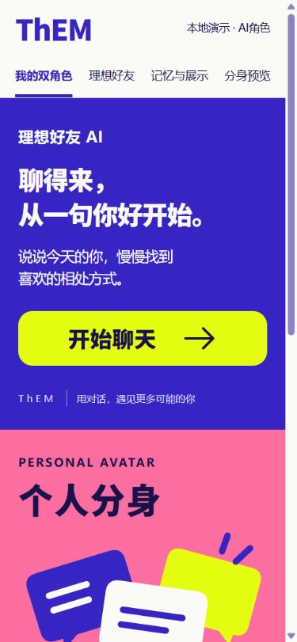
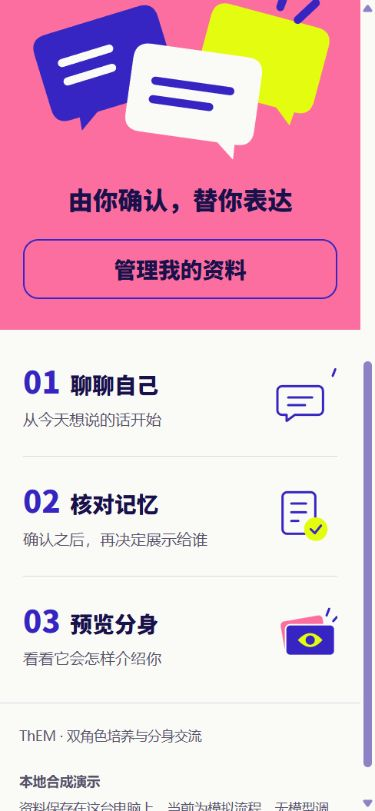

# 五分钟合成演示

先按仓库首页启动`mock`模式。以下句子均为合成示例，不描述仓库作者。

1. 从首页进入理想好友，发送“我不主动，但希望朋友主动。我最近参加过一次合唱演出。”
2. 主动整理当前消息，到记忆页核对候选。模拟提供器只识别这三条固定子句，不具备开放文本理解能力。
3. 确认“我不主动”和“我最近参加过一次合唱演出”为本人资料，“希望朋友主动”为好友期待。确认后默认私有。
4. 仅允许两条本人资料用于访客表达。进入分身预览，查看实际允许内容并提问。回复会明确标记模拟。
5. 返回记忆页撤回合唱资料，再回预览。旧会话失效，新预览不再包含该资料。撤回约束后续系统使用，不会让已经看见内容的人失去记忆。

重点体验确认、归属、用途、版本和撤回。真实模型的自然表达需要单独验收，不能用固定模拟回复判断。

## 移动端展示

| 首页上半部分 | 首页下半部分 |
| --- | --- |
|  |  |

这些是既有本地模拟检查的截图。仓库启动时数据库为空，不预置截图所用操作历史。
