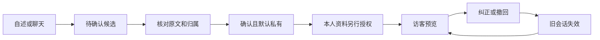

# ThEM 首版PRD摘要

版本：2026.09.23。对象是原BP中“双角色培养”与“分身交流”的局部演示，不取代完整商业方案。

## 问题与范围

交友前的信息了解存在两个任务：访客想问具体问题；本人想准确表达并控制可披露范围。需求依据是既有网络资料整理与6款社交产品比较，未开展用户访谈，需求普遍性仍待验证。

理想好友回应“我希望怎样相处”，个人分身表达“我是什么样的人”。“我不主动，但希望朋友主动”必须分别归入本人事实与好友期待。

| 首版实现 | 留在原规划 |
| --- | --- |
| 自述、理想好友聊天、主动整理、逐条核对 | 心理卡片测量、人设基础库、话题成就树 |
| 两类记忆分开保存；确认默认私有 | 根据期待匹配他人分身 |
| 本人资料另行允许访客使用；预览和提问 | 双方分身预聊、匹配度与真人联系 |
| 编辑、停用、撤回、资料变化后重开会话 | 真正多用户账号、广场及公网运营 |

## 主流程与规则

1. 主动整理只读取固定范围内的主人消息；AI回答和访客消息不作为本人自述。
2. 提取必须有可逐字核验的原文。模型提议不等于用户确认，临时指令不应保存成长期偏好。
3. 确认后仅本人可用。好友期待不能授权为本人的对外事实。
4. 编辑产生新版本并重置使用范围；原文依据和操作记录保留。
5. 有效资料变化后旧会话不能继续生成；晚到结果保留核对记录但不发布，旧预览正文不返回访客。
6. 未知事实不编造，不替真人承诺；简短回答自然表达，界面明确AI身份。

## 四个工作区

首页解释两个角色并突出聊天；理想好友页交流和主动整理；记忆页核对、确认与设置用途；预览页检查访客实际能获得什么。

视觉迭代根据操作者“入口不明显、提示偏小、社交感不足”的反馈采用鲜明配色和并排角色。完成了桌面与窄屏检查，尚无真实用户偏好或转化测试。

## 异常和验收

保存失败保留草稿；不确定的请求先核对状态，不自动重复调用。服务重启将未闭合任务标为待核对。访客接口不能读取私人原文、来源或修改记忆。

程序检查与固定合成演示验证状态和边界；真实模型另用固定输入检查含义与表达。两者分别记录，不互相替代。当前验收结论见[评测摘要](evaluation.md)。

后续产品验证应关注资料维护负担、本人认可程度、访客是否获得有用信息及自然交流感。没有用户数据前，不给这些目标填写已实现的提升数字。
