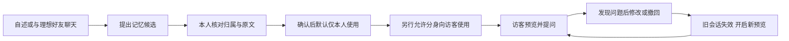

# ThEM：从AI社交设想到可检查的分身表达

**原项目：2024.09—2025.01。新增实践：2026.09。**

原项目交付为商业计划书。我负责除原型设计外的工作，包括竞品研究、需求整理、产品定位、MVP范围与流程、可行性和商业规划；原型由队友完成。2026年在此基础上继续梳理PRD，并在Codex协助下完成技术实验和本地Web演示。我参与范围确认、关键产品取舍和本地固定验收，提出交互与表达反馈；本轮代码、测试脚本和复核文档由助手协助编写，不能归为本人独立开发。

### 1. 先明确用户要完成的事

ThEM想探索的是：在决定是否进一步认识一个人之前，能否获得更具体的信息，同时控制自己的资料如何被表达。

前期材料包含6款社交产品的功能比较、竞品界面记录，以及对信息维度、筛选成本和隐私顾虑的整理。由此形成两个相互关联的任务：了解他人的人，希望问清自己关心的细节；被了解的人，希望表达准确，且能够决定哪些信息可供对方使用。

这些材料支持问题分析和方案提出，没有证明需求在目标人群中的普遍程度。原阶段未开展用户访谈或用户测试，部分网络数据的原始出处尚不完整，因此本案例不使用缺少出处的需求占比或市场规模来证明机会。

### 2. 为什么设计两个角色

“我是什么样的人”与“我希望朋友怎样回应”可能不同。例如“我不主动，但希望朋友主动”，前半句描述自己，后半句描述期待。如果合成同一个画像，分身可能把期待中的特征说成本人的特征。

因此，原方案区分：

- **理想好友AI**：回应用户的交流期待，通过互动逐步形成相处方式。
- **个人AI分身**：依据用户提供的信息表达本人，承担被他人了解的入口。

原BP的完整主路径是：**卡片与聊天培养 → 形成双角色 → 参照期待匹配 → 分身预聊 → 用户查看记录 → 申请联系真人。** 另有分身广场，让用户直接与他人分身交流，再决定是否申请联系。

匹配、双方分身预聊和真人联系仍是原规划，本轮没有把它们写成已实现功能。原BP中的心理测量和匹配分数，也没有经过本轮实验验证。

### 3. 把方案与替代方式放在一起看

| 方式 | 可能解决的问题 | 需要付出的代价或成立条件 |
| --- | --- | --- |
| 资料卡／直接查看原文 | 快速了解明确事实，容易核对 | 内容有限；不一定覆盖当前问题 |
| 直接与真人聊天 | 可以澄清意图，获得真实回应 | 双方要投入时间，并决定披露多少信息 |
| 与个人分身交流 | 按问题组织已允许使用的信息，支持初步探索 | 需要培养、授权和维护；可能误解或编造，交流也可能让人尴尬 |

分身是否值得使用，要看它提供的信息能否帮助用户判断，以及维护和阅读的负担是否值得。AI聊得更多、回答更长，都不能直接当成产品价值。原竞品截图已出现智能打招呼，因此“能生成开场白”不足以成为ThEM的差异化结论。

商业规划同样需要以价值为前提。原BP讨论过匹配、筛选和破冰相关会员权益，也考虑过用户转移到熟人社交平台后的留存问题。它们是商业假设，没有付费用户或营收验证。本轮先核对调用与维护成本，没有预设定价或盈利结论。

### 4. 先做所有后续功能都依赖的一段

如果分身记错了信息，或者继续使用已撤回的内容，即使加上匹配和预聊，结果也不可信。因此，本地演示先实现资料形成、确认、授权、表达和纠正。

界面提供“我的双角色、理想好友、记忆与展示、分身预览”四个工作区。数据保存于本地SQLite；当前是单个合成人物、同一操作者切换主人与访客视角，不是真实多人社交产品。

关键规则是：候选不自动成为记忆，确认不自动允许对外使用；修改内容后重新确认使用范围；资料变更后开始新的预览，避免旧聊天把已撤回的信息带回来。原始依据与操作历史保留，便于发现并解释错误。

### 5. 技术验证怎样服务产品取舍

先用合成资料检查表达，再比较资料怎样进入模型。技术路线分为三种，不能混称为三个模型：

| 路线 | 实际机制 | 本轮判断 |
| --- | --- | --- |
| T0：完整授权资料 | 程序筛出当前允许使用的资料，一次交给生成模型 | 短资料下容易理解与排查，本地应用采用此基线 |
| T1：固定RAG | 先过滤权限和版本，再用本地BGE向量检索相关片段，交给生成模型 | 实验支持特定范围内输入减少，未证明质量更高 |
| 受限单Agent | 用LangGraph组织状态和分支，由模型选择读取、查看来源、澄清或结束，程序执行检查 | 已有真实动作选择与失败记录，未证明普遍收益；未接为应用默认流程 |

本地BGE负责把文本转成向量，配合程序找相关片段；它不负责生成聊天回答。Agent选择读取时，第一次决策尚未看到工具结果，读取后通常需要再调用生成模型；直接澄清或结束则可以只调用一次。

**RAG的一个可复查结果：**在7组不共享返回的个人分身留出对照中，T0输入5,935 tokens，T1输入4,375 tokens，减少26.28%。两组核心通过情况相同，且存在共同失败；这不是准确率提升、稳定提速或已核验账单降幅。题目来自同一合成人物，语义复核由助手完成，没有独立人工盲评。

**Agent的一个取舍：**角色修正后的5道已见合成题中，固定流程完整通过1题，Agent通过3题；Agent用了7次调用，固定流程5次，输入分别为9,232与6,788 tokens。这里既有改善也有失败，样本和评价条件不足以支持“Agent整体更好”。因此保留实验与失败，不继续为追求全通过追加同题测试。

SQL用于把这个判断算清楚：任务和调用分表，一个任务可能多次调用，同一返回也可能被两个模式共用；按调用统计用量，按任务关联评价，不把未知消耗填成零。已整理历史日志并执行8条查询，形成可复查结果，没有把它扩成独立数分项目。

### 6. 真实验收暴露的两类错误

第一类是**记忆含义错误**。初版把“我不主动，但希望朋友主动”整条归为本人信息。修正后两类信息分开了，却又把“不要替我补充演出时间和地点”这条临时写作要求记成朋友期待。

这使提取顺序进一步明确：先判断是否适合记忆，再判断对象和适用范围，最后按原文提取并分类。针对同一冻结输入的恢复验证返回了三条正确候选，没有再收录临时指令。但相邻用例未执行，原失败仍然保留，不能宣称所有提取场景已解决。

第二类是**事实边界成立，交流仍不自然**。第二版应用先由操作者忽略错误候选、确认正确内容，再完成三次分身检查：

| 检查 | 实际观察 |
| --- | --- |
| 问主动性与近期活动 | 输入仅含两条授权的本人资料，未混入朋友期待 |
| 追问日期与场馆 | 承接前文，明确不知道具体细节，没有补造 |
| 修改主动性、撤回合唱资料后重开预览 | 新请求只含更新后的主动性，无旧聊天，未复述撤回经历 |

这些结果支持本例的资料范围与更新机制。它经过人工确认，且不同阶段提示词版本有变化，不能作为自动提取到回答无干预通过的证明。

操作者仍指出回答冗长，反复解释“我是AI分身”“根据目前资料”，像在做汇报。因此新增明确的表达要求：普通闲聊直接用第一人称回答，一两句足够就停；未知可以简答，不例行朗读资料规则或强行追问。AI身份保留在界面，被问及时如实说明。新规则已写入本地提示词，通过相关程序检查，真实模型口吻尚未复测。

### 模型选择与产品判断

实验初期采用DeepSeek建立单一生成模型基线：中文短资料任务、JSON输出和有限预算便于接入，同时避免比较完整资料、检索与Agent时改变生成模型。这个选择没有经过多厂商择优，不能等同最终生产选型。

正式开发应先检查事实与权限边界、数据处理条件，再比较交流自然度、角色忠实、延迟、稳定性和有效会话成本。2026.09.23补充的方案建议优先加入Qwen3.7-Plus，与DeepSeek同题盲评，再决定默认模型；这是待执行建议，尚无跨模型胜负结果。当前回答冗长也可能来自提示词和展示方式，不能直接归因为某家模型的固有缺陷。

### 7. 交付到哪一步

目前交付包括原BP、2026独立PRD、RAG与Agent对照记录、日志SQL及本地Web演示。演示已有自述、聊天、候选确认、授权、预览、修改和撤回流程，并有有限真实模型返回支持部分行为。

尚未证明的部分包括：分身是否像本人、真实用户是否愿意维护资料、是否帮助判断交友对象，以及付费意愿和社交效果。完整匹配、双分身预聊、真人联系与公网运营尚未实现。旧提取失败、新口吻待实测和界面检查限制均保留。

这个项目形成的产品判断是：先让资料来源、使用范围和纠错机制可检查，再讨论分身能否带来更好的交流。是否加入RAG或Agent，也应由资料规模、任务需要和实际结果决定。
